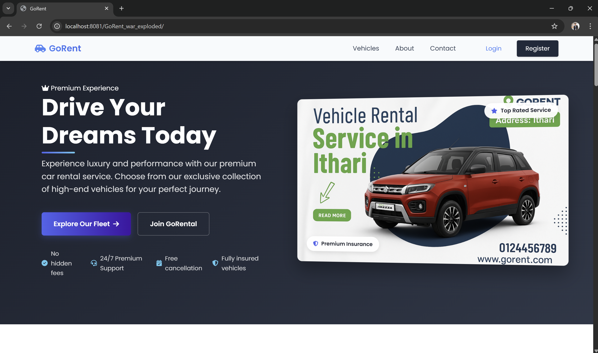
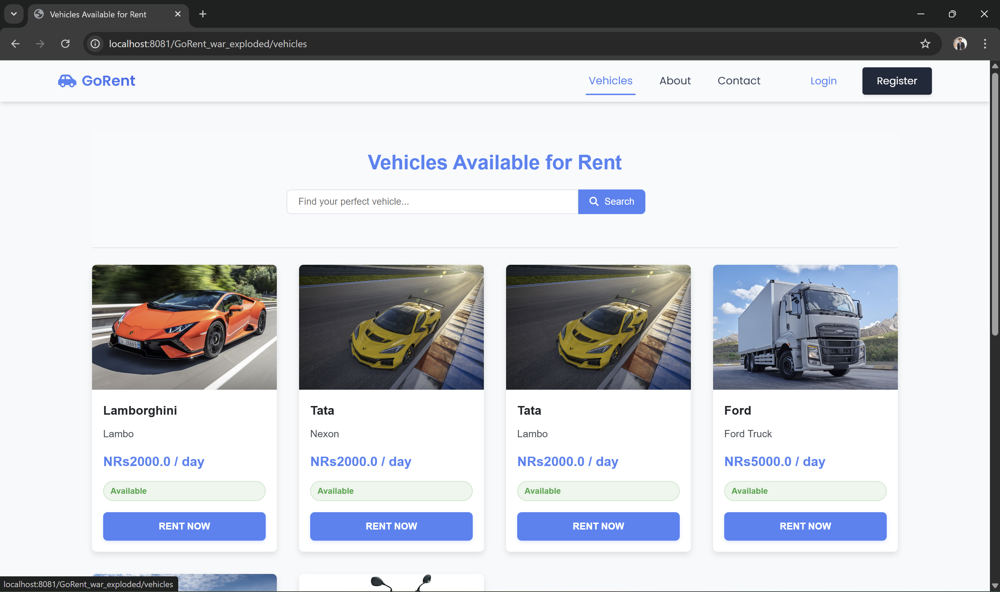
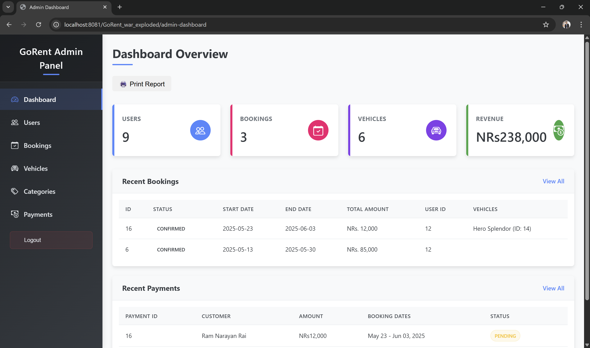

<<<<<<< HEAD
# Vehicle Rental System

A web-based Java application that allows users to rent vehicles online and provides administrative functionalities for managing vehicles and rental records.

---

## 🚀 Aim

To design and develop a dynamic vehicle rental system with a user-friendly interface and secure administrative control using Java-based web technologies.

---

## 🎯 Objectives

- Implement user registration and authentication
- Allow customers to browse and book vehicles
- Enable admins to manage vehicle and rental records
- Integrate database operations using JDBC or JPA
- Maintain session handling and role-based access
- Generate rental invoices and track booking history

---

## 📝 Project Overview

The **Vehicle Rental System** facilitates online vehicle booking for users while granting full control to administrators for managing inventory and transactions. Developed using **Jakarta EE**, it employs a **layered MVC architecture**, integrates with a **MySQL** database, and is deployed on an **Apache Tomcat** server.

---

## 👥 User Roles & Permissions

### 🧑‍💼 Customer Features

- Register and login
- Browse available vehicles
- Book vehicles for specific dates
- View booking history
- Simulate payments

### 👨‍💻 Admin Features

- Admin login
- Add, update, delete vehicle records
- View and manage all rental bookings
- Manage registered users
- Update vehicle status

---

## 🛠️ Technology Stack

| Layer      | Technology                     |
|------------|---------------------------------|
| Frontend   | HTML, CSS, JavaScript, JSP      |
| Backend    | Jakarta EE (Servlets, JSP)      |
| Database   | MySQL                           |
| Architecture | MVC (Model-View-Controller)  |
| Server     | Apache Tomcat                   |
| Tools      | Eclipse IDE, JDBC or JPA        |

## 📸 Screenshots

### 🔐 Login Page


### 📋 Admin Dashboard


### 🕓 Booking History


## 🧪 How to Run This Project

To run the Vehicle Rental System on your local machine, follow the steps below:

### ✅ Prerequisites

- Java JDK 8 or higher
- Eclipse IDE (Enterprise Edition recommended)
- Apache Tomcat 9 or compatible
- MySQL Server
- Web browser (e.g., Chrome, Firefox)

---

### ⚙️ Step-by-Step Instructions

1. **Clone or Download the Project**

   ```bash
   git clone https://https://github.com/Nikesh-Shah/Vehicle-Rental-System.git

=======
# Vehicle-Rental-System
>>>>>>> ad9dfcc3d05f47919fda923479efed59f456dc4e
